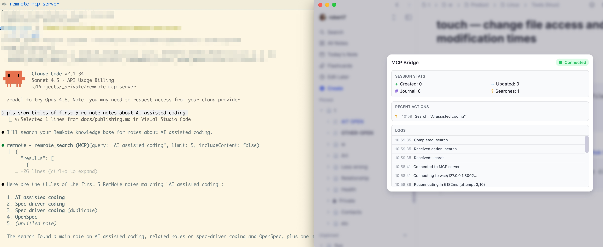

# RemNote MCP Server

[](https://github.com/robert7/remnote-mcp-server/actions/workflows/ci.yml)

MCP server that bridges Claude Code (and other MCP clients) to [RemNote](https://remnote.com/) via the [RemNote MCP
Bridge plugin](https://github.com/robert7/remnote-mcp-bridge).

## Demo

See Claude Code in action with RemNote: **[View Demo →](docs/demo.md)**



## What is This?

The RemNote MCP Server enables AI assistants like Claude Code to interact directly with your RemNote knowledge base
through the Model Context Protocol (MCP). This allows you to create notes, search your knowledge base, update existing
notes, and maintain your daily journal—all through conversational commands.

**Architecture:**

```text
AI agent (e.g. Claude Code, MCP Client) ↔ MCP Server (stdio) ↔ WebSocket Server :3002 ↔ RemNote Plugin ↔ RemNote
```

The server acts as a bridge:

- Communicates with Claude Code via stdio transport (MCP protocol)
- Runs a WebSocket server (port 3002) that the RemNote browser plugin connects to
- Translates MCP tool calls into RemNote API actions

## Features

- **Create Notes** - Create new notes with optional parent hierarchy and tags
- **Search Knowledge Base** - Full-text search with configurable result limits
- **Read Notes** - Retrieve note content with configurable child depth
- **Update Notes** - Modify titles, append content, add/remove tags
- **Journal Entries** - Append timestamped entries to daily documents
- **Connection Status** - Check server and plugin connection health

## Important Limitations

**This MCP server enforces a strict 1:1:1 relationship:** one AI agent ↔ one MCP server instance ↔ one RemNote plugin
connection.

### Multi-Agent Constraints

You **cannot** use multiple AI agents (e.g., two Claude Code sessions) with the same RemNote knowledge base
simultaneously. Three architectural constraints prevent this:

1. **stdio transport is point-to-point** - Each MCP server process communicates with exactly one AI agent via
   stdin/stdout. The transport protocol doesn't support multiple clients.
2. **WebSocket enforces single-client** - The server explicitly rejects multiple RemNote plugin connections. Only one
   plugin instance can connect to port 3002 at a time (connection code: 1008).
3. **Port binding conflict** - Multiple server instances attempting to use the default port 3002 will fail with
   `EADDRINUSE`.

### Practical Implications

- **One agent at a time** - Close one Claude Code session before starting another if both need RemNote access
- **No concurrent access** - Cannot have multiple AI assistants modifying your RemNote knowledge base simultaneously
- **Separate workspaces don't help** - Even with different ports, only one plugin instance can connect to RemNote at a
  time

### Alternative Approach

If you need multiple AI agents with separate note-taking systems, use separate RemNote accounts/workspaces and configure
each with its own MCP server instance on different ports.

### Future Plans

**HTTP transport migration planned** - The single-agent limitation is a temporary architectural constraint. A future
version will migrate from stdio transport to HTTP transport (SSE), which would allow multiple AI agents to connect
to the same MCP server instance simultaneously. This would remove constraint #1 above while maintaining the existing
WebSocket bridge to RemNote.

## Prerequisites

- **Node.js** >= 18.0.0
- **RemNote app** with [RemNote MCP Bridge plugin](https://github.com/robert7/remnote-mcp-bridge) installed
- **Claude Code CLI** installed and configured

## Installation

### 1. Install the MCP Server

**From source (recommended for development):**

```bash
git clone https://github.com/robert7/remnote-mcp-server.git
cd remnote-mcp-server
npm install
npm run build

# Creates global symlink: makes remnote-mcp-server command available system-wide
npm link

# Verify it worked
which remnote-mcp-server
# Should output e.g.: /Users/<username>/.nvm/versions/node/<version>/bin/remnote-mcp-server
```

**What npm link does:** Creates a symbolic link from your global `node_modules` bin directory to this project's
executable, allowing Claude Code to launch `remnote-mcp-server` from anywhere without publishing to npm.

**Important:** Claude Code CLI must have access to the same Node.js environment where you ran `npm link`. If Claude Code
uses a different Node.js version or environment (e.g., different shell PATH), it won't find the command. Ensure your
shell configuration (`.bashrc`, `.zshrc`) properly exposes your Node.js environment.

**Unlinking the global command:**

When you no longer want the global `remnote-mcp-server` command to point to your local repository:

```bash
# Remove the global symlink
npm unlink -g remnote-mcp-server

# Verify it's removed
which remnote-mcp-server
# Should output nothing if successfully unlinked
```

After unlinking, you can install the published package globally with `npm install -g remnote-mcp-server` if needed.

**About stdio transport**

This MCP server uses [stdio transport](https://modelcontextprotocol.io/specification/2025-06-18/basic/transports#stdio),
the preferred communication mechanism for MCP. In stdio transport, Claude Code launches the server as a subprocess and
exchanges JSON-RPC messages via standard input/output streams.

**Key characteristics:**

- **Lifecycle management**: Claude Code automatically starts the server when it launches and stops it on exit. The
  server is launched as a subprocess, not a standalone service.
- **Message protocol**: Communication uses newline-delimited JSON-RPC messages on stdin (client → server) and stdout
  (server → client). No HTTP/REST endpoints are exposed.
- **Logging constraint**: stdout is reserved exclusively for MCP protocol messages. All logging must go to stderr, which
  is why the codebase uses `console.error()` for logs.

This architecture provides tight integration with Claude Code while maintaining process isolation and security
boundaries. For technical details, see the [MCP
specification](https://modelcontextprotocol.io/specification/2025-06-18/basic/transports).

### 2. Install RemNote MCP Bridge Plugin

Install the [RemNote MCP Bridge plugin](https://github.com/robert7/remnote-mcp-bridge) in your RemNote app:

1. Open RemNote
2. Navigate to plugin installation (see plugin repository for instructions)
3. Configure WebSocket URL: `ws://127.0.0.1:3002`
4. Enable auto-reconnect

### 3. Configure Claude Code CLI

MCP servers are configured in `~/.claude.json` under the `mcpServers` key within project-specific sections.

**Add to your `~/.claude.json`:**

```json
{
  "projects": {
    "/Users/username": {
      "mcpServers": {
        "remnote": {
          "type": "stdio",
          "command": "remnote-mcp-server",
          "args": [],
          "env": {
            "REMNOTE_WS_PORT": "3002"
          }
        }
      }
    }
  }
}
```

**Configuration Notes:**

- **Global availability:** Use your home directory path (`/Users/username`) to make RemNote tools available in all
  projects
- **Project-specific:** Use a specific project path to limit availability to that project
- **Multiple projects:** Add `mcpServers` configuration under each project path as needed

**Example with multiple projects:**

```json
{
  "projects": {
    "/Users/username": {
      "mcpServers": {
        "remnote": {
          "type": "stdio",
          "command": "remnote-mcp-server",
          "args": [],
          "env": {
            "REMNOTE_WS_PORT": "3002"
          }
        }
      }
    },
    "/Users/username/Projects/my-project": {
      "mcpServers": {
        "remnote": {
          "type": "stdio",
          "command": "remnote-mcp-server",
          "args": [],
          "env": {
            "REMNOTE_WS_PORT": "3002"
          }
        }
      }
    }
  }
}
```

### 4. Restart Claude Code

Restart Claude Code completely to load the MCP server configuration. The server will start automatically when Claude
Code launches.

## Verification

### Check Server is Running

After Claude Code restarts, verify the server started:

```bash
# Check process is running
ps aux | grep remnote-mcp-server

# Check WebSocket port is listening
lsof -i :3002
```

You should see the `remnote-mcp-server` process running.

### Check RemNote Plugin Connection

Open RemNote with the MCP Bridge plugin installed. The plugin control panel should show:

- **Status:** "Connected" (green)
- **Server:** ws://127.0.0.1:3002
- Connection timestamp

### Test in Claude Code

In any Claude Code session, try:

```
Use remnote_status to check the connection
```

Expected response:

```json
{
  "connected": true,
  "actionsProcessed": 0,
  "pluginVersion": "1.1.0",
  "timestamp": "2026-02-07T..."
}
```

### Test RemNote Integration

Try creating a note:

```
Create a RemNote note titled "MCP Test" with content "Testing the bridge"
```

This should use the `remnote_create_note` tool and create a new note in your RemNote knowledge base.

## Available Tools

| Tool | Description | Parameters |
|------|-------------|------------|
| `remnote_create_note` | Create a new note with optional parent and tags | `title`, `content`, `parentId`, `tags` |
| `remnote_search` | Search knowledge base | `query`, `limit`, `includeContent` |
| `remnote_read_note` | Read note by RemNote ID | `remId`, `depth` |
| `remnote_update_note` | Update title, append content, or modify tags | `remId`, `title`, `appendContent`, `addTags`, `removeTags` |
| `remnote_append_journal` | Append to today's daily document | `content`, `timestamp` |
| `remnote_status` | Check connection status and statistics | _(no parameters)_ |

## Example Usage

### Conversational Commands

Claude Code will automatically select the appropriate tool based on your natural language commands:

**Create notes:**
```
Create a note about "Project Ideas" with content:
- AI-powered note taking
- Personal knowledge management
```

**Search:**
```
Search my RemNote for notes about "machine learning"
```

**Read specific notes:**
```
Read the note with ID abc123
```

**Update notes:**
```
Add a tag "important" to note abc123
```

**Journal entries:**
```
Add to my journal: "Completed the RemNote MCP integration"
```

**Check status:**
```
Check if RemNote is connected
```

## Configuration

### Environment Variables

- `REMNOTE_WS_PORT` - WebSocket server port (default: 3002)

**Example with custom port:**

```json
{
  "projects": {
    "/Users/username": {
      "mcpServers": {
        "remnote": {
          "type": "stdio",
          "command": "remnote-mcp-server",
          "args": [],
          "env": {
            "REMNOTE_WS_PORT": "3003"
          }
        }
      }
    }
  }
}
```

**Note:** If you change the port, you must also update the WebSocket URL in the RemNote MCP Bridge plugin settings.

### RemNote Plugin Settings

Configure in the plugin control panel:

- **WebSocket URL:** `ws://127.0.0.1:3002` (or your custom port)
- **Auto-reconnect:** Enabled (recommended)

## Troubleshooting

### Server Not Starting

1. **Check if globally linked:**
   ```bash
   which remnote-mcp-server
   ```
Should return a path to the executable.

2. **Re-link if needed:**
   ```bash
   cd ~/Projects/_private/remnote-mcp-server
   npm link
   ```

3. **Check Claude Code logs:**
   ```bash
   tail -f ~/.claude/debug/mcp-*.log
   ```

### Port 3002 Already in Use

If you see "EADDRINUSE" error:

```bash
# Find what's using the port
lsof -i :3002

# Kill the process if needed
kill -9 <PID>
```

Alternatively, configure a different port in both `~/.claude.json` and the RemNote plugin settings.

### Plugin Won't Connect

1. **Verify plugin settings in RemNote:**
   - WebSocket URL: `ws://127.0.0.1:3002`
   - Auto-reconnect: Enabled
2. **Check plugin console (RemNote Developer Tools):**
   ```
   Cmd+Option+I (macOS)
   Ctrl+Shift+I (Windows/Linux)
   ```

3. **Restart RemNote** after changing settings
4. **Check server logs** for connection messages

### Tools Not Appearing in Claude Code

1. **Verify configuration in `~/.claude.json`:**
   ```bash
   cat ~/.claude.json | grep -A 10 mcpServers
   ```

2. **Ensure configuration is under correct project path** (use home directory for global)
3. **Restart Claude Code completely** (not just reload)
4. **Check MCP logs:**
   ```bash
   tail -f ~/.claude/debug/mcp-*.log
   ```

### Configuration Not Working

**Common issue:** Using the old `~/.claude/.mcp.json` file format

❌ **Old format (deprecated):**
```json
// File: ~/.claude/.mcp.json
{
  "remnote": { ... }
}
```

✅ **Correct format:**
```json
// File: ~/.claude.json
{
  "projects": {
    "/Users/username": {
      "mcpServers": {
        "remnote": { ... }
      }
    }
  }
}
```

The `enabledMcpjsonServers` setting in `~/.claude/settings.json` is also deprecated and no longer needed.

## Development

### Setup

```bash
npm install
npm run build
npm link  # Make command globally available
```

### Development Workflow

```bash
npm run dev          # Watch mode with hot reload
npm run typecheck    # Type checking only
npm run build        # Production build
```

### Testing

```bash
npm test             # Run all tests
npm run test:watch   # Watch mode
npm run test:coverage # With coverage report
```

### Code Quality

```bash
./code-quality.sh    # Run all checks
npm run lint         # ESLint only
npm run format       # Format code
```

### Before Committing

Run `./code-quality.sh` to ensure all checks pass.

### Manual Testing

To test the server independently (without Claude Code):

```bash
# Stop Claude Code first to free port 3002
cd ~/Projects/_private/remnote-mcp-server
npm run dev
```

Expected output:
```
[WebSocket Server] Listening on port 3002
[MCP Server] Server started on stdio
```

When the RemNote plugin connects:
```
[WebSocket Server] Client connected
[RemNote Bridge] RemNote plugin connected
```

Press Ctrl+C to stop.

### Development Documentation

- **[IMPLEMENTATION.md](./IMPLEMENTATION.md)** - Technical implementation details
- **[AGENTS.md](./AGENTS.md)** - AI agent and developer guidance
- **[CHANGELOG.md](./CHANGELOG.md)** - Version history

## Related Projects

- [RemNote MCP Bridge Plugin](https://github.com/robert7/remnote-mcp-bridge) - Browser plugin for RemNote integration
- [Model Context Protocol](https://modelcontextprotocol.io/) - Open protocol for AI-application integration

## License

MIT
