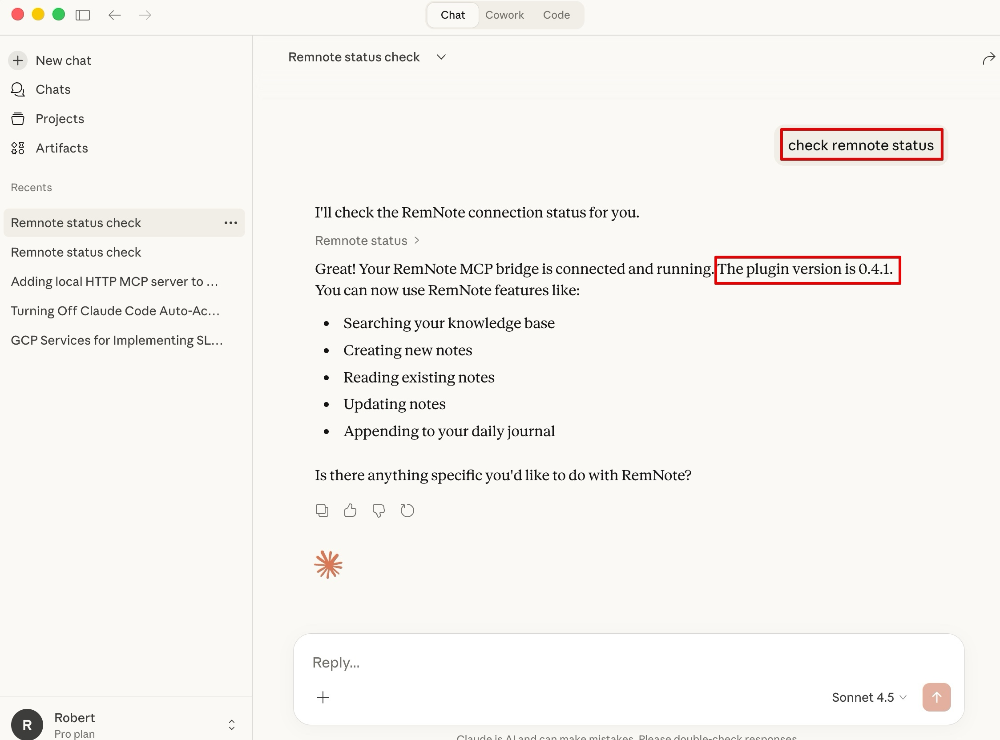
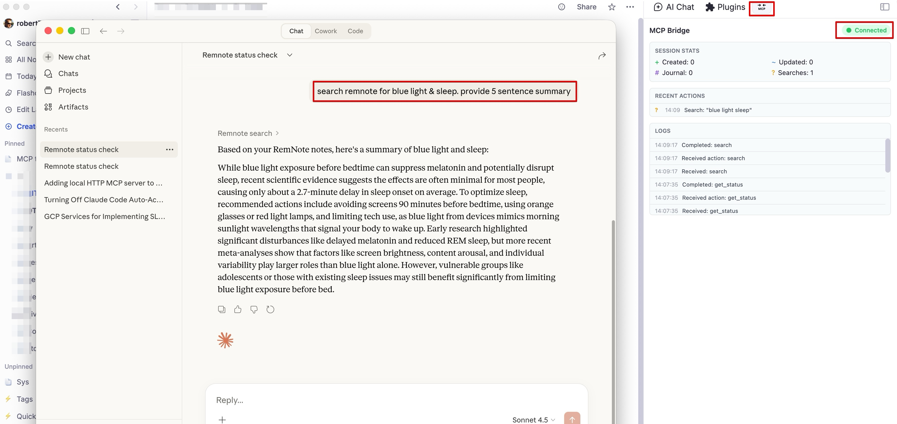
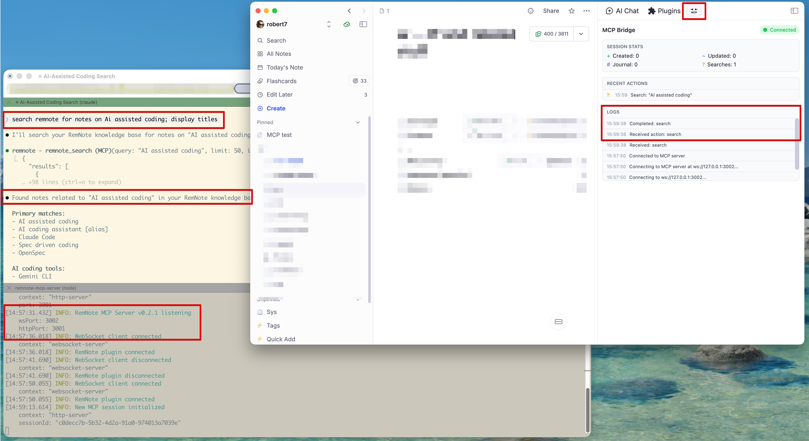

# Demo

Visual demonstrations of the RemNote MCP Server with different AI clients.

## Claude Cowork

Cloud-based integration through web interface.

**Setup:** [Claude Cowork Configuration Guide](guides/configuration-claude-cowork.md) | [Remote Access
Guide](guides/remote-access.md)

### Connection Status Check

Checking RemNote Bridge connection status, displaying plugin version (0.4.1) and available features (search, create,
read, update, journal append).

### Knowledge Base Search

Searching RemNote knowledge base for "blue light & sleep" with AI-generated summary. The RemNote Bridge plugin panel (right
side) shows connection statistics and recent actions.

## Accomplish

Task-based interface using [Accomplish (formerly Openwork)](https://github.com/accomplish-ai/accomplish) with [OpenAI's
GPT 5.2 model](https://openai.com/).

**Setup:** [Accomplish Configuration Guide](guides/configuration-accomplish.md)

The screenshot shows Accomplish querying RemNote about "diffusion of innovations" through the local MCP server. The
interface displays multiple MCP tool calls (`remnote_search` and `remnote_read_note`) with an AI-synthesized summary
of findings from the knowledge base.

## Claude Code CLI 

Local CLI-based integration showing search and connection logs.

**Setup:** [Claude Code CLI Configuration Guide](guides/configuration-claude-code-CLI.md)

The screenshot shows Claude Code CLI searching RemNote for "AI assisted coding" through the terminal, with RemNote Bridge
connection logs visible in the background.
