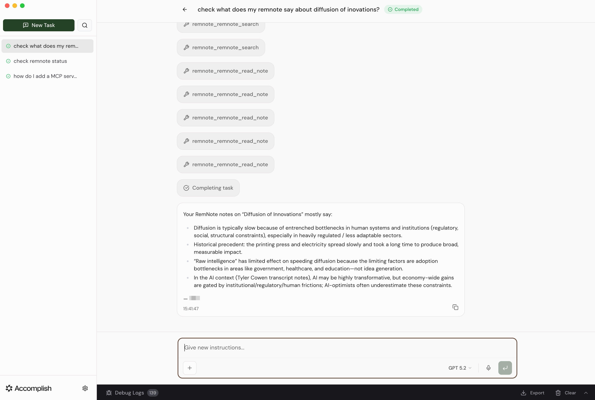

# Demo

Visual demonstrations of the RemNote MCP Server with different AI clients.

## Claude Cowork (Cloud-based via ngrok)

Cloud-based integration through web interface. See [ngrok setup guide](ngrok-setup.md) for configuration.

### Connection Status Check

Checking RemNote MCP bridge connection status, displaying plugin version (0.4.1) and available features (search, create,
read, update, journal append).

### Knowledge Base Search

Searching RemNote knowledge base for "blue light & sleep" with AI-generated summary. The MCP Bridge plugin panel (right
side) shows connection statistics and recent actions.

## Accomplish with GPT 5.2 (Local)

Task-based interface using [Accomplish (formerly Openwork)](https://github.com/accomplish-ai/accomplish) with [OpenAI's
GPT 5.2 model](https://openai.com/):

The screenshot shows Accomplish querying RemNote about "diffusion of innovations" through the local MCP server. The
interface displays multiple MCP tool calls (`remnote_search` and `remnote_read_note`) with an AI-synthesized summary
of findings from the knowledge base.

## Claude Code (Local)

Local CLI-based integration showing search and connection logs:

The screenshot shows Claude Code searching RemNote for "AI assisted coding" through the terminal, with MCP Bridge
connection logs visible in the background.
