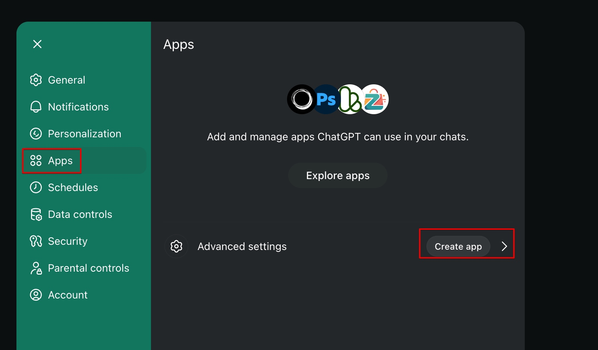
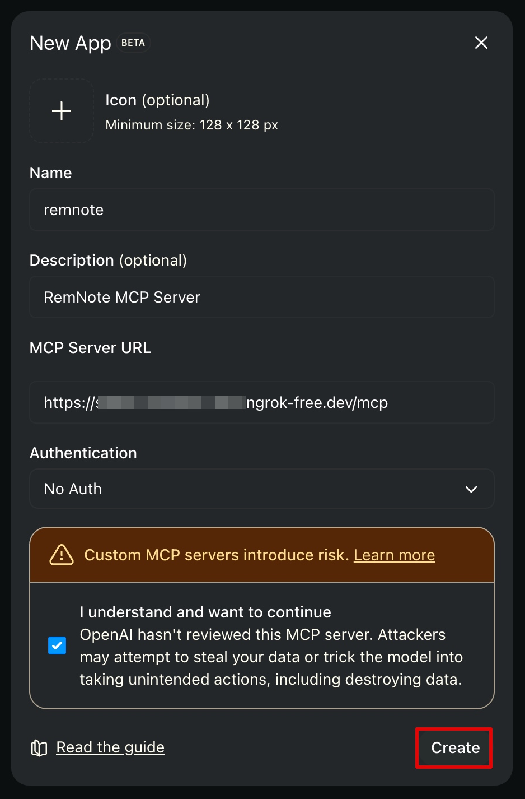
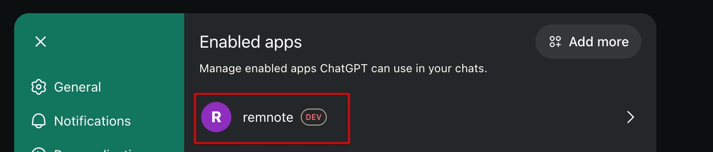
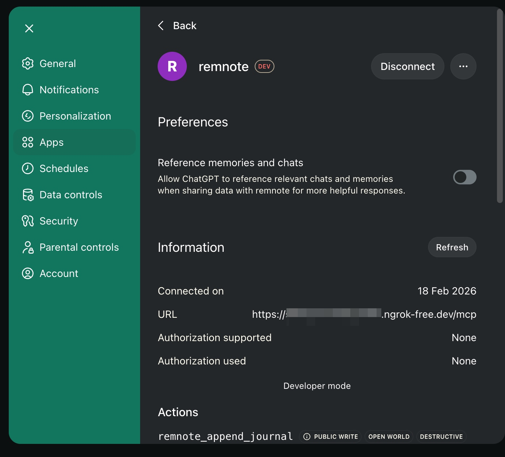
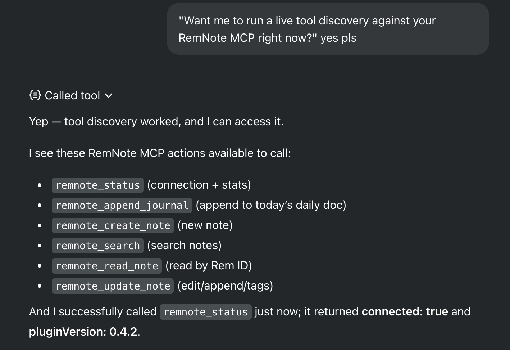
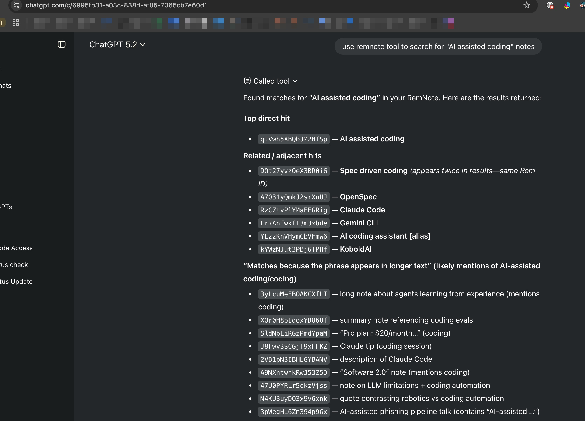

# ChatGPT Configuration

Set up ChatGPT Apps to connect to your RemNote MCP Server.

> Prerequisite: ChatGPT custom private MCP server setup currently requires Developer Mode to be enabled and an eligible
> paid ChatGPT subscription.  See:
> [OpenAI's Developer Mode guide](https://developers.openai.com/api/docs/guides/developer-mode/).

## Step 1: Open Apps settings

Open ChatGPT settings, go to **Apps**, and click **Create app**.

## Step 2: Create the MCP app

Enter your app details and MCP Server URL, confirm the custom server warning, then click **Create**.

## Step 3: Confirm app is enabled

Verify your `remnote` app appears in the enabled apps list.

## Step 4: Verify connection details and actions

Open the app details page to confirm URL, connection status, and exposed RemNote actions.

## Step 5: Run tool discovery

Ask ChatGPT to run discovery and verify it can list and call RemNote tools (including `remnote_status`).

## Step 6: Test a real RemNote query

Run a real search prompt and confirm ChatGPT returns results from your RemNote knowledge base.

