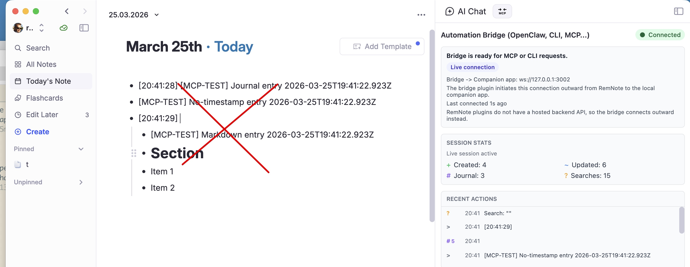
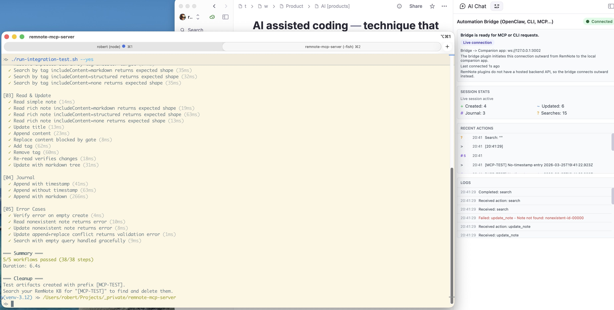

# Integration Testing

This is the canonical workflow for updating and running shared integration coverage for `remnote-mcp-server` and
`remnote-cli`.

Use it when a feature changes the shared bridge-consumer surface and should be validated end to end against a live
RemNote instance.

For CLI-specific command details, see the companion [CLI Integration Testing
Guide](https://github.com/robert7/remnote-cli/blob/main/docs/guides/integration-testing.md).

## Safety And Cleanup

Integration tests create new RemNote data, but they do **not** delete, overwrite, or replace existing user data.

Artifacts are easy to find because they are grouped predictably:

- MCP server artifacts use the `[MCP-TEST]` prefix
- CLI artifacts use the `[CLI-TEST]` prefix
- note/tree artifacts live under `RemNote Automation Bridge [temporary integration test data]`
- journal artifacts appear in Today's Note with the same prefixes

RemNote's bridge surface does not expose delete operations, so cleanup stays manual by design.




## Prerequisites

1. RemNote running with the RemNote Automation Bridge plugin installed
2. MCP server available, either already running (`npm run dev`, `npm start`, or `remnote-mcp-server`) or started by
   the agent wrapper
3. Bridge connected to the WebSocket server
4. CLI daemon running as well when you want to run the CLI integration suite

If the bridge is connected correctly, the server logs show the plugin connection and RemNote shows the Automation
Bridge as connected.


## Running The Suites

### MCP Server Suite

```bash
# Interactive — prompts before creating content
npm run test:integration

# Non-interactive — skips confirmation
npm run test:integration -- --yes

# Fast connection check only (no test data creation)
./run-status-check.sh

# Agent-assisted — starts the server if needed, waits for bridge connection, then runs the suite
./run-agent-integration-test.sh
./run-agent-integration-test.sh --yes
```

### CLI Suite

From the `remnote-cli` repo:

```bash
# Start or keep the daemon running first
./run-daemon-in-foreground.sh

# Run the live CLI integration suite
./run-integration-test.sh
./run-integration-test.sh --yes

# Agent-assisted — starts the daemon if needed, waits for bridge connection, then runs the suite
./run-agent-integration-test.sh
./run-agent-integration-test.sh --yes
```

The MCP server and bridge should already be connected before running the CLI suite.
The agent-assisted wrappers are the only approved live-test entrypoint for AI agents; they time out with a clear
message when the RemNote bridge never connects.
Agent-assisted flow still has one manual gate: the agent should ask the human collaborator to start the bridge first,
and must ask for a bridge restart before reruns if bridge code changed since the current RemNote bridge session
started.
When switching from the CLI suite to the MCP server suite, stop the CLI daemon first so the MCP server can bind the
shared WebSocket port.

Successful runs print a workflow summary and remind you how to clean up the created artifacts.



## Configuration

| Variable | Default | Purpose |
|---|---|---|
| `REMNOTE_MCP_URL` | `http://127.0.0.1:3001` | MCP server base URL |
| `MCP_TEST_DELAY` | `2000` | Delay (ms) after creating notes before searching |

CLI-specific variables are documented in the [CLI Integration Testing Guide](https://github.com/robert7/remnote-cli/blob/main/docs/guides/integration-testing.md).

## Where To Add New Coverage

If a pull request changes shared external behavior, update integration coverage in both repos where the feature can be
exercised.

- MCP server entrypoint: [`test/integration/run-integration.ts`](../../test/integration/run-integration.ts)
- MCP server workflows: [`test/integration/workflows/`](../../test/integration/workflows/)
- CLI entrypoint: [`remnote-cli/test/integration/run-integration.ts`](https://github.com/robert7/remnote-cli/blob/main/test/integration/run-integration.ts)
- CLI workflows: [`remnote-cli/test/integration/workflows/`](https://github.com/robert7/remnote-cli/tree/main/test/integration/workflows)

The usual rule is simple: if users can reach the new behavior through both MCP server and CLI, both integration suites
should gain coverage.

## What The Suites Test

Both suites follow the same shape:

1. **Status Check** — Verifies the live consumer path is connected to the bridge. If this fails, all subsequent workflows are
   skipped.
2. **Create & Search** — Creates two notes (simple and rich with content/tags), waits for RemNote indexing, then
   validates search and tag-search behavior across the supported content modes.
3. **Read & Update** — Reads the created notes, updates title/content/tags, and re-reads to verify persistence.
4. **Journal** — Appends entries to today's daily document with and without timestamps.
5. **Error Cases** — Sends invalid inputs (nonexistent IDs, missing required fields) and verifies the server handles
   them gracefully.
6. **Read Table** — Reads a pre-configured Advanced Table by name and Rem ID, then validates pagination, filtering,
   and not-found behavior.

## Cleanup After A Run

Test content uses `[MCP-TEST]` or `[CLI-TEST]` prefixes plus unique run IDs (ISO timestamps), and note/tree artifacts
are grouped under the shared root-level anchor note `RemNote Automation Bridge [temporary integration test data]`.

To clean up:

- search RemNote for `[MCP-TEST]` and delete the matching note/tree artifacts
- search RemNote for `[CLI-TEST]` and delete the matching CLI-created artifacts
- open Today's Note and remove the matching journal entries

RemNote's bridge plugin does not support deleting notes, so test artifacts persist and must be cleaned up manually.
The shared anchor note is reused across runs. If more than one exact anchor-title match exists, the integration setup
fails early and prints the duplicate `remId`s so you can clean them up first.

## Design Rationale

The integration tests are deliberately separate from the unit test suite. They require external infrastructure (running
server + connected plugin), create real content, and take seconds rather than milliseconds. They run via `tsx` with
custom lightweight assertions rather than Vitest to stay independent from the mocked unit-test environment.

## Read Table Configuration

The `read_table` workflow requires a pre-existing Advanced Table in RemNote. This keeps the coverage read-only while
still validating the shared bridge-consumer contract.

### Setup

1. Create an Advanced Table in RemNote with at least one row and one column.
2. Record the table's exact name and `remId`.
3. Create or edit the config file at:

   **Windows:** `C:\Users\<your-username>\.remnote-mcp-bridge\remnote-mcp-bridge.json`

   **macOS/Linux:** `~/.remnote-mcp-bridge/remnote-mcp-bridge.json`

4. Add the integration test configuration:

```json
{
  "integrationTest": {
    "tableName": "Your Table Name",
    "tableRemId": "abc123def"
  }
}
```

### Running

Run the integration suite as usual:

```bash
npm run test:integration
```

The `read_table` workflow is skipped when either field is missing or the config is invalid.
